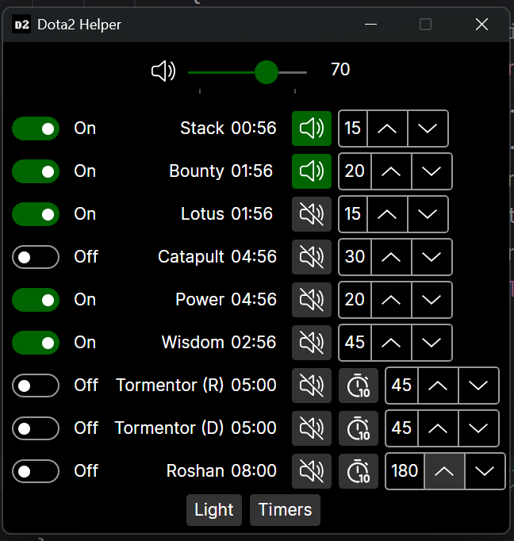
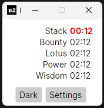
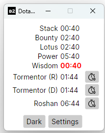

# Dota 2 Helper

[](https://github.com/pjmagee/dota2-helper/actions/workflows/build.yaml) 

An objective timer tracker with audio notifications for Dota 2. This application is designed to help players keep track of important in-game events such as stacking, power runes, bounty runes, and more. The application is designed to be used in conjunction with the Game State Integration feature of Dota 2.

## Platform

Only Windows is supported at this time.

## Features

- Timers view optimised to place over Dota 2 Game in full screen mode
- Customisable timers with intervals and reminders
- Audio notifications for each timer
- Dark & light modes available
- Manual reset for random spawns (e.g. Tormentor)
- Advanced settings to modify audio files and intervals

## Game State Integration

Go to `..\steamapps\common\dota 2 beta\game\dota\cfg\gamestate_integration` and add the following file:

`gamestate_integration_timers.cfg`

```plaintext
"Dota 2 Integration Configuration"
{
    "uri"           "http://localhost:4001/"
    "timeout"       "5.0"
    "buffer"        "0.1"
    "throttle"      "0.1"
    "heartbeat"     "1.0"
    "data"
    {
        "provider"      "0"
        "map"           "1"
        "player"        "0"
        "hero"          "0"
        "abilities"     "0"
        "items"         "0"
    }
}
```

## Run

Run the `Dota2Helper.Desktop.exe`

## Settings

- Customise notifications with mute feature
- Customise the timer configuration
- Customise the overall volume of the helper app
- Manually reset timers for those with random spawns
- Features dark and light mode
- UI is fixed as 'On top' meaning you can place this over your game when running in Windows full screen mode
- Additional advanced configuration is possible with the `appsettings.json`

## Advanced settings

Labels, removal of UI elements, intervals, starting times, and audio has additional customisation for advanced users

<!-- markdownlint-disable MD033 -->
<details>
<summary>appsettings.json</summary>

```json
{
  "DotaTimers": [
    {
      "Label": "Stack",
      "First": "02:00",
      "Interval": "01:00",
      "Reminder": "00:15",
      "AudioFile": "audio/Stack.mp3",
      "IsManualReset": false,
      "IsEnabled": true
    },
    {
      "Label": "Wisdom",
      "First": "07:00",
      "Interval": "07:00",
      "Reminder": "00:45",
      "AudioFile": "audio/Wisdom.mp3",
      "IsManualReset": false,
      "IsEnabled": true
    },
    {
      "Label": "Bounty",
      "First": "00:00",
      "Interval": "03:00",
      "Reminder": "00:20",
      "AudioFile": "audio/Bounty.mp3",
      "IsManualReset": false,
      "IsEnabled": true
    },
    {
      "Label": "Power",
      "First": "06:00",
      "Interval": "06:00",
      "Reminder": "00:20",
      "AudioFile": "audio/Power.mp3",
      "IsManualReset": false,
      "IsEnabled": true
    },
    {
      "Label": "Lotus",
      "First": "03:00",
      "Interval": "03:00",
      "Reminder": "00:15",
      "AudioFile": "audio/Lotus.mp3",
      "IsManualReset": false,
      "IsEnabled": true
    },
    {
      "Label": "Tormentor (R)",
      "First": "20:00",
      "Interval": "10:00",
      "Reminder": "00:45",
      "AudioFile": "audio/Tormentor.mp3",
      "IsManualReset": true,
      "IsEnabled": true
    },
    {
      "Label": "Tormentor (D)",
      "First": "20:00",
      "Interval": "10:00",
      "Reminder": "00:45",
      "AudioFile": "audio/Tormentor.mp3",
      "IsManualReset": true,
      "IsEnabled": true
    },
    {
      "Label": "Roshan",
      "First": "11:00",
      "Interval": "11:00",
      "Reminder": "03:00",
      "AudioFile": "audio/Roshan.mp3",
      "IsManualReset": true,
      "IsEnabled": false
    },
    {
      "Label": "Catapult",
      "First": "05:00",
      "Interval": "05:00",
      "Reminder": "00:30",
      "AudioFile": "audio/Catapult.mp3",
      "IsManualReset": false,
      "IsEnabled": false
    }
  ]
}
```

</details>

## UI Screenshots





